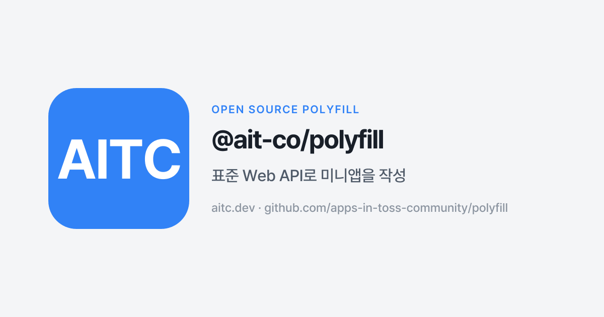

# @ait-co/polyfill

[한국어](./README.md) · **English**



[](https://www.npmjs.com/package/@ait-co/polyfill)
[](./LICENSE)

Web standard API polyfill for Apps in Toss mini-apps. Write your mini-app with **standard Web APIs** (`navigator.clipboard`, `navigator.geolocation`, …) and have it transparently work inside Apps in Toss.

## Install

```sh
pnpm add @ait-co/polyfill
```

`@apps-in-toss/web-framework` is an **optional peer dependency**. Apps that only target a pure-web context don't need to install it — polyfill stays inert and the browser natives remain in charge.

```sh
pnpm add @apps-in-toss/web-framework   # only if you also ship a Toss build
```

The package ships dual ESM + CJS builds, so `require('@ait-co/polyfill/auto')` works in CommonJS hosts too.

## Usage

### Just add the dep (recommended)

Import the side-effect entry once at app start. Detection + install happens automatically; in a plain browser it's a no-op.

```ts
import '@ait-co/polyfill/auto';

// Anywhere later:
await navigator.clipboard.writeText('hello');
```

### Explicit install

If you need to know **when** the polyfill attached (to gate init) or to tear it down, call `install()` yourself:

```ts
import { install, uninstall } from '@ait-co/polyfill';

const restore = await install(); // resolves when detection completes

// ...

restore(); // or uninstall()
```

`install()` is async — the returned promise resolves with an uninstall function. When we're not inside Apps in Toss the returned function is a no-op, because no shim was installed. Calling `install()` more than once is safe.

Each shim stashes the original `navigator`/`window` value so `uninstall()` restores it cleanly — useful in tests.

### Subpath imports (bundle-size sensitive)

If you want to pick individual shims without the auto-install wiring:

```ts
import { installClipboardShim } from '@ait-co/polyfill/clipboard';

installClipboardShim(); // installs unconditionally — gate with detect.ts if you want Toss-only
```

The package's `sideEffects` field accurately lists every dist entry that actually has one (the main entry `.`, `/auto`, and each per-API subpath, in both ESM and CJS) — each entry explicitly calls the devtools-detection sentinel (`globalThis.__AIT_POLYFILL__`, see [Sentinel](#sentinel-local-detection) below) at its own top level. A subpath you never import is still dropped by tree-shaking.

## Environment detection

Polyfill calls `getAppsInTossGlobals()` from the SDK to decide whether we're actually inside Apps in Toss. That call is synchronous and reads a bridge constant — in a plain browser the RN bridge isn't attached and the call throws synchronously (microsecond-scale), so the startup cost is negligible.

You can override detection for tests via `globalThis.__AIT_POLYFILL_FORCE__ = 'toss' | 'browser'`.

## Supported APIs

Tier 1 — all shipped; paired SDK routing is live when inside Apps in Toss.

| Web standard | SDK counterpart | Landed in |
|---|---|---|
| `navigator.clipboard.readText()` / `writeText(text)` | `getClipboardText()` / `setClipboardText(text)` | 0.1.0 |
| `navigator.geolocation.getCurrentPosition()` | `getCurrentLocation({ accuracy })` | 0.1.1 |
| `navigator.geolocation.watchPosition()` / `clearWatch()` | `startUpdateLocation(...)` | 0.1.1 |
| `navigator.share({ title, text, url })` | `share({ message })` (concatenates into `message`) | 0.1.1 |
| `navigator.vibrate(pattern)` | `generateHapticFeedback(...)` (best-effort, lossy; see below) | 0.1.1 |
| `navigator.onLine` / `navigator.connection.effectiveType` | `getNetworkStatus()` (poll on read; `change` events synthesised via polling when a listener is attached) | 0.1.1 |
| `window.open(url, '_blank')` (Tier 2, limited) | `openURL(url)` — `_blank` only, returns a stub Window; see [Tier 2 evaluation](#tier-2-evaluation-2026-05) | 0.1.9 |

### Tier 1 verification status (as of 2026-07)

Each Tier 1 shim is exercised on three layers before it is considered shipped:
its own `*.test.ts` (unit, three branches: Toss-mock, browser-only, neither),
the cross-cutting `devtools-composition.test.ts` (single `install()` driving
all shims through a devtools-shaped SDK mock), and an end-to-end ApiCard in
`apps-in-toss-community/sdk-example` that calls the **standard Web API**
directly. A real Apps in Toss app sanity check on miniApp `31146`
(`aitc-sdk-example`) is the final layer; `31146` has no released bundle and
sits in `PREPARE`, so the column reads "pending" (a 2026-07-26 console check
confirms no REVIEW lock is set and the app review itself is approved) — none
of the unit / composition / e2e gates have ever broken on a Tier 1 shim, so
the not-yet-released sanity is purely confirmatory.

| Shim | Unit | devtools-composition | sdk-example e2e | Real Apps in Toss app |
|---|---|---|---|---|
| clipboard    | ✅ | ✅ | ✅ | pending (31146 not released · PREPARE) |
| geolocation  | ✅ | ✅ | ✅ | pending |
| share        | ✅ | ✅ | ✅ | pending |
| vibrate      | ✅ | ✅ | ✅ | pending |
| network      | ✅ | ✅ | ✅ | pending |

When `31146` has a released bundle (its `serviceStatus` moves out of
`PREPARE`), the real-app column will be filled in via a follow-up PR; no
shim changes are expected to fall out of that step.

## Tier 2 evaluation (2026-05)

The Tier 2 candidates listed in earlier roadmaps were assessed against the
SDK 3.x surface (`@apps-in-toss/web-framework` exports). Of the four, one
ships in a deliberately limited form and three are formally moved to
out-of-scope.

| Candidate | Decision | Rationale |
|---|---|---|
| `window.open` ↔ SDK `openURL` | **ship limited** | `openURL` opens the URL in the device's default browser / associated app via React Native's `Linking.openURL`, which only matches the `_blank` "open elsewhere" semantic of `window.open`. The shim routes only `target='_blank'` (or omitted target); `_self` and named targets fall through to native. The returned `Window` is a no-op stub (`closed: true`, methods are no-ops) — code that drives the popup will not work and should call `openURL` directly. |
| `localStorage` ↔ SDK Storage | **skip → out-of-scope** | `localStorage` is sync (`getItem` returns a string immediately) while the SDK's `Storage` (`getItem` / `setItem` / `removeItem` / `clearItems`) is async — irreconcilable without breaking caller assumptions. More importantly, the native `localStorage` already works correctly in the Apps in Toss WebView, so no shim is needed and a "polyfill" would only widen surface area. |
| `history.back()` ↔ SDK `closeView` | **skip → out-of-scope** | `closeView` closes the entire mini-app view (described as "닫기 버튼 … 서비스를 종료할 때") — not a nav-stack pop. Mapping `history.back()` to `closeView()` would silently terminate the mini-app whenever a sub-route wanted to go back. There is no safe heuristic for "is this the bottom of the nav stack" that doesn't false-positive. |
| `document.visibilityState` / `visibilitychange` | **skip — unnecessary** | The standard Page Visibility API already works inside the Apps in Toss WebView, and `onVisibilityChangedByTransparentServiceWeb` is a transparent-service-specific event with a different shape. No polyfill required. |

### `navigator.vibrate` mapping

The Web `vibrate` spec only takes durations; the SDK's `generateHapticFeedback` is qualitative. Single-duration calls bucket like this inside Apps in Toss:

| Input | SDK haptic |
|---|---|
| `vibrate(0)` / `vibrate([])` | no-op (cancels native pending vibration) |
| `vibrate(1..20)` | `tickWeak` |
| `vibrate(21..45)` | `tickMedium` |
| `vibrate(>=46)` | `basicMedium` |
| `vibrate([on, off, on, off, ...])` | each non-zero "on" slot fires `tap`, with `setTimeout` honouring the gaps |

Length-only mapping cannot recover semantic intent (success vs. error vs. warning). When the caller knows what the haptic *means*, prefer the helper:

```ts
import { vibrateSemantic } from '@ait-co/polyfill/vibrate-semantic';

vibrateSemantic('success');   // → SDK 'success'
vibrateSemantic('error');     // → SDK 'error'
vibrateSemantic('warning');   // → SDK 'tickMedium' (no direct variant)
vibrateSemantic('selection'); // → SDK 'tickWeak'  (no direct variant)
```

The helper does not install anything and does not touch `navigator.vibrate`. It also re-exports from the package root (`import { vibrateSemantic } from '@ait-co/polyfill'`) for convenience, but the sub-path is the tree-shake-friendly form.

Outside Apps in Toss, `vibrateSemantic` falls back to a short `navigator.vibrate(...)` so the user still gets *some* feedback. `navigator.vibrate(...)` keeps its standard signature in every environment — the helper is the only way to pass intent.

### `window.open` mapping (Tier 2, limited)

```ts
window.open('https://example.com', '_blank'); // → SDK openURL (device browser)
window.open('https://example.com');            // (target omitted) → SDK openURL
window.open('https://example.com', '_self');   // → native (in-document nav)
window.open('https://example.com', 'myPopup'); // → native (named target)
```

Target matching is case-sensitive (per HTML spec, `_blank` is the lowercase
keyword; `_BLANK` is treated as a named browsing context and falls through
to native).

The returned object in the routed (`_blank`) case is a **no-op stub Window**:
`closed` is `true` from the start, and `close` / `focus` / `blur` /
`postMessage` are silent no-ops. Code that depends on driving the popup
window (form submission, `postMessage` round-trips, polling for `closed`) is
not supported via the shim — call `openURL` from
`@apps-in-toss/web-framework` directly when you need that.

To install just this shim manually instead of installing everything via `/auto`,
use the `@ait-co/polyfill/window-open` subpath:

```ts
import { installWindowOpenShim } from '@ait-co/polyfill/window-open';

const uninstall = installWindowOpenShim(); // call the returned fn to revert
```

See [`INTEGRATION.md`](./INTEGRATION.md) for an adoption guide (Vite + React
snippet, recommended pairing with `@ait-co/devtools`, per-API one-liners).

APIs without a reasonable Web standard counterpart (auth, IAP, ads, analytics, Toss-specific environment info) stay in the `@apps-in-toss/web-framework` namespace — polyfill is not the home for "everything the SDK does." Rationale in [`CLAUDE.md`](./CLAUDE.md).

The Tier 2 candidates that landed as out-of-scope (Storage, `history.back`,
`visibilitychange`) are listed with rationale in
[Tier 2 evaluation](#tier-2-evaluation-2026-05).

## Sentinel (local detection)

This package sends no telemetry. It exposes a `globalThis.__AIT_POLYFILL__` sentinel so the devtools companion can detect that the polyfill is loaded. The sentinel is used solely for local in-browser detection — no data is sent anywhere.

```ts
// read-only, non-enumerable — do not use in application code.
// This is an internal contract consumed by devtools.
globalThis.__AIT_POLYFILL__; // { version: string; loaded: true }
```

Privacy policy: <https://docs.aitc.dev/privacy>

## Development

```sh
pnpm install
pnpm test
pnpm lint
pnpm typecheck
pnpm build
```

### Pre-commit hook

Optional but recommended. After cloning, activate the standard pre-commit hook (runs `biome check` on staged files):

```sh
git config core.hooksPath .githooks
```

This is a developer convenience for fast feedback before push. CI runs the same checks as the enforcement layer, so contributors who don't activate the hook will still see lint failures in their PR.

## License

BSD-3-Clause

---

Community open-source project.
